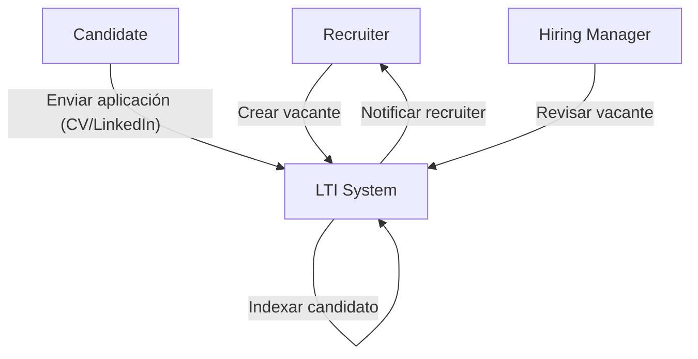
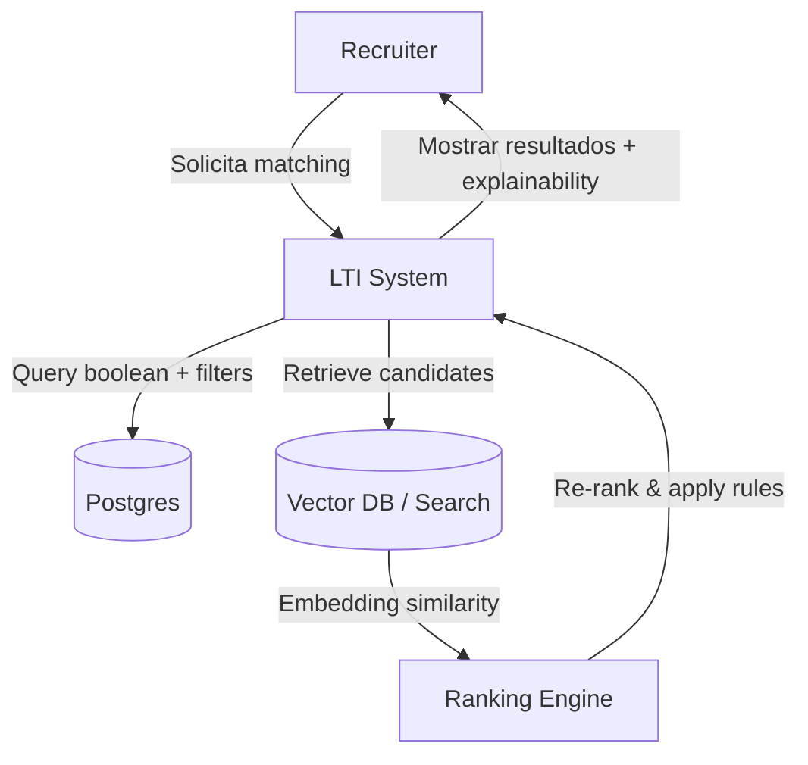
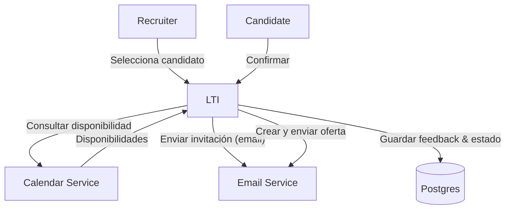
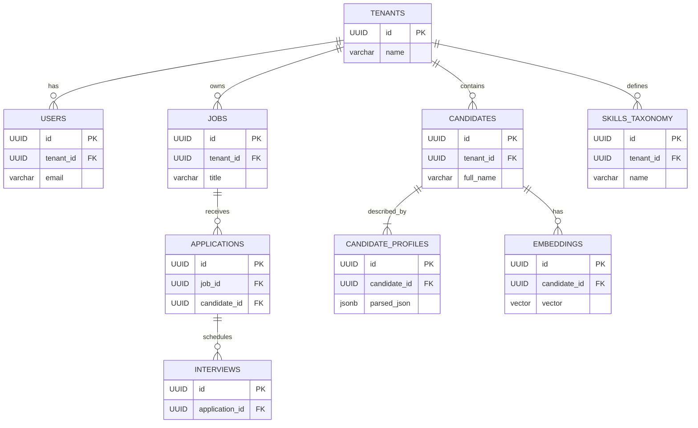
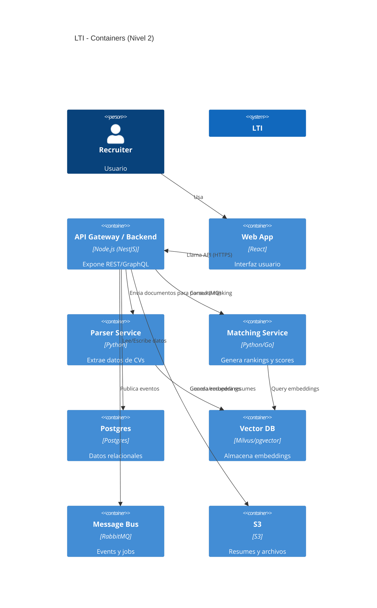
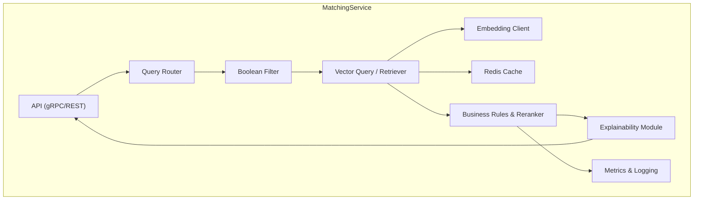

# LTI — ATS del futuro (Versión 1)  

> Documento técnico: diseño, modelado, casos de uso y arquitectura de la primera versión (MVP) de LTI — Applicant Tracking System moderno.  
> Autor: Equipo técnico (asistente). Fecha: 25 Nov 2025.

---

## Resumen ejecutivo
**LTI** será un Applicant Tracking System (ATS) orientado a mejorar dos frentes clave: *quality of hire* (mejor candidato por puesto) y *time-to-hire* (reducir tiempos), usando matching semántico avanzado, parsing de CVs robusto, workflows personalizables y privacidad desde el diseño. El primer lanzamiento (v1) está pensado como MVP que permita validar adopción en empresas medianas y equipos de reclutamiento.

### Valor añadido
- Matching semántico híbrido (rule-based + embeddings) para mejorar las recomendaciones.
- Ingesta automática y limpieza de CVs (PDF/Word/LinkedIn).
- Workflows configurables y pipeline de entrevistas.
- Integración sencilla con correo, calendarios y HRIS.
- Privacidad y trazabilidad: auditoría y consentimiento de candidatos.

### Ventajas competitivas
1. **Matching híbrido** que combina lógica de negocios y ML ajustable por el reclutador (control explicable).
2. **Pipeline de parsing** robusto con normalización y extracción de skills (taxonomía propia).
3. **UX de workflows**: plantillas reutilizables + reglas de automatización low-code.
4. **Observabilidad y métricas** integradas (quality-of-hire, fuente por rendimiento).
5. **Tiempo rápido de onboarding**: enfoques preconfigurados para equipos TA (talent acquisition).

---

## MVP: Funciones principales (v1)
1. Ingreso manual y masivo de candidatos (CSV, PDF, DOCX, sync LinkedIn).
2. Parser de CV + extracción de skills/experiencia/educación.
3. Búsqueda y matching (boolean + semántico).
4. Pipeline de selección: etapas, notas, entrevistas, ofertas.
5. Integración de email y calendario (envío de invitaciones).
6. Dashboard de métricas y reporting básico.
7. Roles y permisos (Admin, Recruiter, Hiring Manager, Guest).
8. Audit logs y export de datos.

---

## Lean Canvas (modelo de negocio — v1)

**Problema**
- Reclutadores pierden tiempo filtrando CVs manualmente.
- Mal matching entre perfiles y vacantes.
- Pérdida de candidatos por mala comunicación.

**Segmentos de cliente**
- Empresas medianas y startups tech (50-1000 empleados).
- Agencias de reclutamiento.
- Equipos de RR.HH. que necesitan mejorar productividad.

**Propuesta de valor única**
ATS con matching semántico y workflows personalizables que reduce tiempo de contratación y aumenta calidad de hire.

**Solución**
- Parser + taxonomía de skills.
- Motor de matching (embeddings + reglas).
- Workflows y automatizaciones.

**Canales**
- Ventas directas (SDR), marketing de contenido, partnerships con job boards, marketplace de integraciones.

**Fuentes de ingresos**
- Suscripción SaaS (por asiento / por vacante).
- Add-ons: búsqueda semántica avanzada, re-ranking con ML, soporte premium.
- Integraciones enterprise (tarifa única).

**Estructura de costos**
- Infra (DBs, vector DB, compute ML).
- Desarrollo (SWE, ML, infra).
- Ventas/marketing.
- Soporte y cumplimiento legal.

**Métricas clave**
- Time-to-fill, time-to-hire.
- % de entrevistas que llegan a oferta.
- Churn MRR.
- N.º de vacantes activas / seat adoption.

**Ventaja injusta**
- Taxonomía y dataset propio de skills + pipelines de parsing afinados.

---

# FASE 1 — Investigación y análisis

## Investigación de mercado (resumen)
- Competidores: Greenhouse, Lever, Workable, BambooHR, SmartRecruiters.
- Gap detectado: pocos con matching explicable y control por reclutador + taxonomía localizable (idiomas, jurisdicción).
- Diferenciador: pipeline de parsing localizable y tuning de matching por negocio.

## Requisitos no funcionales (principales)
- **Seguridad**: cifrado at-rest y in-transit; RBAC; logging de accesos.
- **Escalabilidad**: diseño para multi-tenant, base de datos por tenant lógico.
- **Disponibilidad**: target 99.9% (MVP tendrá SLAs básicos).
- **Latencia**: búsqueda y matching < 300ms para consultas simples.
- **Privacidad**: consentimiento explícito para datos del candidato; borrado por petición.

---

# FASE 2 — Casos de uso (3 principales)

A continuación 3 casos de uso prioritarios para v1, cada uno con su descripción y diagrama mermaid.

## Caso de uso 1 — "Publicar vacante y recibir candidatos"
**Actores:** Recruiter, Hiring Manager, Sistema (LTI).  
**Descripción:** El reclutador crea una vacante con descripción, asigna hiring manager y activa el flujo. LTI expone formulario de publicación y genera un enlace público y formulario de aplicación. Candidatos aplican; el sistema parsea CVs y los indexa.

**Flujo resumido:**
1. Recruiter crea vacante.
2. Sistema publica y genera link.
3. Candidato aplica (upload CV o LinkedIn).
4. Parser extrae datos; candidato indexado.
5. Reclutador recibe notificación.

**Diagrama (mermaid)**



---

## Caso de uso 2 — "Buscar y hacer matching de candidatos"
**Actores:** Recruiter, Sistema, Ranking Engine.  
**Descripción:** El reclutador busca candidatos para una vacante; el sistema devuelve lista mezclada (boolean + semántico) ordenada por score. El reclutador filtra y comenta.

**Flujo resumido:**
1. Recruiter abre vacante y solicita matching.
2. Sistema ejecuta pipeline de matching: boolean -> semantic re-rank -> business rules.
3. Devuelve top N candidatos con explicación del score.
4. Recruiter marca para entrevista.

**Diagrama (mermaid)**



---

## Caso de uso 3 — "Coordinar entrevista y ofertar"
**Actores:** Recruiter, Candidate, Calendar, Email Service.  
**Descripción:** Tras preselección, recruiter envía invitación a entrevista; sistema coordina horarios, envía recordatorios y almacena feedback. Si procede, se crea oferta y se envía para firma.

**Flujo resumido:**
1. Recruiter selecciona candidato y propone horarios.
2. Sistema consulta disponibilidad (calendario) y envía invitación.
3. Candidate confirma; se guardan en pipeline.
4. Feedback se registra; si OK -> crear oferta y enviar.

**Diagrama (mermaid)**



---

# FASE 3 — Modelado de datos

## Entidades y atributos (v1 — selección principal)
A continuación las tablas principales, con atributos y tipos simplificados (Postgres).

1. **tenants**
- id: UUID (PK)
- name: varchar
- created_at: timestamptz
- plan: varchar

2. **users**
- id: UUID (PK)
- tenant_id: UUID (FK -> tenants.id)
- email: varchar
- name: varchar
- role: varchar
- password_hash: varchar
- created_at: timestamptz
- last_login: timestamptz

3. **jobs**
- id: UUID (PK)
- tenant_id: UUID (FK)
- title: varchar
- description: text
- location: varchar
- status: varchar -- (draft, open, closed)
- hiring_manager_id: UUID (FK -> users.id)
- created_at: timestamptz
- open_date: date
- close_date: date

4. **candidates**
- id: UUID (PK)
- tenant_id: UUID (FK)
- full_name: varchar
- email: varchar
- phone: varchar
- source: varchar
- resume_url: varchar
- created_at: timestamptz

5. **candidate_profiles**
- id: UUID (PK)
- candidate_id: UUID (FK -> candidates.id)
- parsed_json: jsonb
- skills: text[] -- normalized list
- years_experience: numeric
- education_summary: text
- keywords: text[]
- created_at: timestamptz

6. **applications**
- id: UUID (PK)
- job_id: UUID (FK -> jobs.id)
- candidate_id: UUID (FK -> candidates.id)
- status: varchar -- (applied, screened, interview, offered, hired, rejected)
- applied_at: timestamptz
- score: numeric
- notes: text

7. **interviews**
- id: UUID (PK)
- application_id: UUID (FK -> applications.id)
- scheduled_at: timestamptz
- duration_minutes: integer
- interviewer_id: UUID (FK -> users.id)
- status: varchar
- feedback: jsonb

8. **skills_taxonomy**
- id: UUID (PK)
- tenant_id: UUID (FK)
- name: varchar
- normalised_name: varchar
- synonyms: text[]

9. **audit_logs**
- id: UUID (PK)
- tenant_id: UUID (FK)
- user_id: UUID (FK)
- action: varchar
- resource: varchar
- timestamp: timestamptz
- details: jsonb

10. **embeddings**
- id: UUID (PK)
- candidate_id: UUID (FK)
- vector: vector -- (if Postgres + pgvector) OR store in Vector DB
- created_at: timestamptz

## Relaciones principales
- tenants 1 — * users
- tenants 1 — * jobs
- tenants 1 — * candidates
- jobs 1 — * applications
- candidates 1 — 1 candidate_profiles
- applications 1 — * interviews
- candidate_profiles 1 — * embeddings (or 1:1 latest embedding)

## Diagrama ER (mermaid)



---

# FASE 4 — Diseño del sistema y arquitectura

## Principios de diseño
- Arquitectura **modular** y basada en microservicios ligeros o monolito modular (para MVP) con componentes desacoplados.
- Escalado horizontal en servicios intensivos (matching, embeddings, file ingestion).
- Uso de servicios gestionados cuando sea posible para acelerar time-to-market.

## Componentes principales (alto nivel)
1. **Frontend**: SPA (React/Next.js) — UI para Recruiters, Hiring Managers y Candidates.
2. **API Gateway / Backend**: Node.js / NestJS (o Go) REST + GraphQL endpoint para UI.
3. **Auth Service**: OAuth2 + JWT (Keycloak o Auth0 para MVP).
4. **Parser Service**: servicio dedicado (Python) para extracción y normalización.
5. **Matching / Ranking Service**: microservicio ML (embeddings, vector search).
6. **Search Index / Vector DB**: ElasticSearch + Vector DB (e.g., Milvus, Pinecone, or Postgres+pgvector).
7. **Database principal**: Postgres (multi-tenant logical).
8. **File Storage**: S3-compatible for resumes.
9. **Message Bus**: Kafka / RabbitMQ for ingestion, events y workers.
10. **Workers**: background jobs para parsing, embeddings, notifications.
11. **Notifications**: Email/Calendar service (SMTP, SendGrid, Google Calendar API).
12. **Monitoring & Logging**: Prometheus, Grafana, ELK.
13. **CI/CD**: GitHub Actions / GitLab CI + IaC (Terraform).

## Diagrama de arquitectura (mermaid — alto nivel)

```mermaid
flowchart LR
  subgraph USER_SIDE
    UI[Frontend (React)]
    Candidate[Candidate]
    Recruiter[Recruiter]
  end

  UI -->|REST / GraphQL| API[API Gateway / Backend]
  Recruiter --> UI
  Candidate --> UI

  API --> Auth[Auth Service (OAuth2)]
  API --> DB[(Postgres)]
  API --> FS[(S3)]
  API --> MQ[(Message Bus)]

  MQ --> ParserService[Parser Service (workers)]
  ParserService --> EmbeddingService[Embedding Generator]
  EmbeddingService --> VectorDB[(Vector DB / ElasticSearch)]
  VectorDB --> Matching[Matching & Ranking Service]
  Matching --> API

  API --> Email[Email/Calendar Service]
  Monitoring -->|metrics| Grafana[Grafana / Prometheus]
  API --> Monitoring
  ParserService --> Monitoring
```

---

## Elección de tecnologías recomendadas (v1)
- Frontend: React + Vite / Next.js
- Backend: Node.js (NestJS) o Go (Gin) — NestJS acelera product.
- DB relacional: Postgres + pgvector (opcional)
- Vector DB: Milvus / Pinecone / Qdrant (o pgvector para MVP)
- Search: ElasticSearch (opcional para facetas)
- Parser: Python (spaCy, pdfminer, python-docx) + heuristics
- Message Bus: RabbitMQ (fácil) o Kafka (a mayor escala)
- Storage: AWS S3 / MinIO (local)
- Auth: Keycloak (self-host) / Auth0 (managed)
- CI/CD: GitHub Actions
- Infra as Code: Terraform
- Observability: Prometheus + Grafana, Sentry

---

# FASE 5 — Diagrama C4 (contexto -> containers -> components)

## C4 - Nivel 1: Contexto
```mermaid
C4Context
  title LTI - Context diagram (Nivel 1)
  PERSON(customer, "Recruiter / Hiring Manager", "Usa LTI para gestionar procesos de selección")
  PERSON(candidate, "Candidate", "Postula a vacantes")
  SYSTEM(system, "LTI ATS", "Sistema que facilita gestión de vacantes y matching")
  PERSON(external_systems, "Calendars / Email / HRIS", "Servicios externos integrados")

  REL(customer, system, "Usa para publicar vacantes, revisar candidatos y coordinar entrevistas")
  REL(candidate, system, "Aplica a vacantes y recibe comunicaciones")
  REL(system, external_systems, "Sincroniza calendarios, envía emails y exporta datos")
```

## C4 - Nivel 2: Contenedores


---

## C4 - Nivel 3: Profundizar en **Matching Service** (componente clave)

### Descripción del componente
El **Matching Service** es el corazón del diferencial de LTI: toma un job + filtros y devuelve candidatos ordenados y explicables. Debe ser rápido, auditado y ajustable por reglas.

### Responsabilidades
- Calcular embeddings de job description y candidate profiles.
- Hacer búsqueda semántica en Vector DB.
- Aplicar reglas de negocio (peso por seniority, fit de idioma, origen fuente).
- Re-rank por métricas (recency, scoring por tests).
- Exponer API para el Backend con explainability.

### Subcomponentes (Diagrama mermaid)



### Interfaces y contratos
- **/match** (POST): entrada job_id + filters -> devuelve list[Candidate {id,score,explain}]
- **/reindexCandidate** (POST): candidate_id -> re-calcula embedding y actualiza Vector DB
- Contrato: respuestas JSON con `score` y `explain` (campo estructurado con contributions).

### Requisitos no funcionales del componente
- Latencia p95 < 300ms (para top 20).
- Tolerancia a fallos: fallback a búsqueda booleana si VectorDB no responde.
- Versionado de modelos y trazabilidad de scores (metadata por run).

---

# Testing, QA y despliegue

## Estrategia de testing (v1)
- **Unit tests** en todos los servicios (jest/pytest).
- **Integration tests**: parser ↔ vector DB ↔ matching.
- **E2E**: pipelines completas (crear vacante -> aplicar candidato -> match -> entrevista).
- **Contract tests** entre Backend y Matching Service.
- **Load tests**: JMeter / k6 (simular ingest y queries).
- **Security tests**: scanning SAST, dependencia y pentesting básico.

## CI/CD pipeline sugerido
1. PR -> run linters, unit tests.
2. Build containers -> integration tests (staging).
3. Deploy to staging -> run e2e + load smoke.
4. Canary deploy to prod (feature flags).
5. Monitor metrics, rollback automático si hay error.

## Observabilidad
- Tracing distribuido (OpenTelemetry).
- Logs centralizados (ELK).
- Métricas: Prometheus + dashboards Grafana.
- Alertas: PagerDuty / Slack.

---

# Roadmap v1 -> v2 (sugerido)
- **v1 (MVP)**: parser, matching básico, workflows, integrations email/calendar.
- **v1.1**: embeddings + explainability, vector DB, role management.
- **v1.5**: mejoras UX, A/B tests de ranking, reporting avanzado.
- **v2**: entrevistas técnicas integradas (coding), assessments, integraciones HRIS, marketplace de job-boards.

---

# Operaciones y seguridad
- **Backups** diarios de Postgres + snapshots de VectorDB.
- **Cifrado** TLS + at-rest (KMS).
- **RBAC** y controles administrativos.
- **Data retention** políticas y borrado de candidato por petición (Right to be forgotten).
- **Compliance**: preparar para GDPR/Local data laws.

---

# KPIs de lanzamiento
- Activación: 10 empresas piloto en 3 meses.
- Performance: median search latency < 200ms.
- Calidad: al menos 25% de entrevistas procedentes de matching automático en 3 meses.
- Retención: churn < 5% durante primer año de pilotos.

---

# Anexos: recomendaciones técnicas rápidas
- Usar **pgvector** para MVP si quieres simplicidad (todo en Postgres).
- Para escala, migrar embeddings a Qdrant / Milvus.
- Parser: combinar reglas (regex) + ML (NER con spaCy) + heuristics para robustez.
- Guardar `parsed_json` para auditoría y re-run del parser si se actualiza el modelo.
- Versionar taxonomía de skills.

---

## Notas finales
Este documento es una base sólida para arrancar la construcción de LTI. Si querís, puedo:
- Generar historias de usuario / backlog priorizado.
- Crear plantillas de API (OpenAPI) y ejemplos de payload.
- Generar diagramas adicionales o detallar un plan de despliegue con IaC (Terraform).

---  
